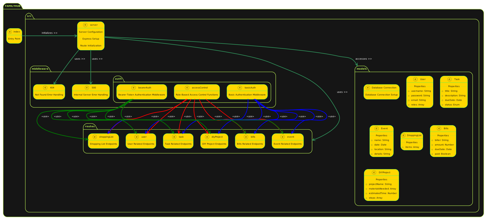

# LAB - Class 09

## Project: FAMILYHUB

### Author: Bryan O. Garduno Gonzalez

### Problem Domain

The Family Hub App is a comprehensive solution aimed at simplifying the organizational needs of a household. It is a centralized platform designed to assist family members in managing their daily life more efficiently. The app includes functionalities for handling a variety of tasks such as managing calendar events, creating grocery lists, tracking pending home projects, and keeping up with bill payments. 

The primary goal of the Family Hub App is to streamline the organization and tracking of daily activities and responsibilities, thereby promoting a harmonious and well-coordinated family life. This app is especially beneficial for families seeking to enhance their day-to-day management and collaboration.

#### Technical Implementation
- **API Auth Server Deployment**: The Family Hub App is built on a robust API Auth server, ensuring secure and reliable deployment.
- **Database Operations**: Powered by a structured API server, the app supports seamless database operations, including comprehensive CRUD (Create, Read, Update, Delete) functionalities for a variety of household tasks, events, shopping lists, and bill management.
- **Access Control**: To ensure security and privacy, each family member has unique login credentials. The app uses an Access Control List (ACL) system to regulate access to sensitive information, ensuring that family members only see what they need to.

#### Presentation Plan
In the presentation, I will showcase the Family Hub's general functionality, focusing on its user-friendly interface that facilitates the easy addition, editing, and tracking of various household activities. The demonstration will include an overview of the system's architecture and a detailed code review to provide insights into the technical aspects of the app.

### Links and Resources

- [GitHub Actions ci/cd](https://github.com/brosmar18/familyHub/actions) 
- Dev [Back-end server Dev Branch url]()
- Main [back-end server main branch url]()

### Collaborators

- **ChatGPT by OpenAI**: Used as a programming partner for brainstorming ideas, debugging code, formulating tests, and drafting documentation. ChatGPT's contributions were invaluable in enhancing the efficiency and quality of the development process.

### Setup

#### `.env` requirements (where applicable)

A .env file is included in local repository. A .env-sample file is uploaed to the remote repo so collaborators understand what environmental variables are being used. 

#### How to initialize/run your application (where applicable)

- e.g. `npm start`

#### How to use your library (where applicable)

## Features / Routes

The Family Hub App offers a variety of features and routes, each designed to cater to the organizational needs of a household. Below is a rough draft of the current features and routes available in the app. 

### User Management
- **POST /signup**: Allows new users to sign up, creating an account in the system.
- **POST /signin**: Enables users to sign in to their account using their credentials.
- **GET /users**: Fetches all registered users. This route is protected and requires appropriate user permissions.
- **GET /users/:id**: Retrieves details of a specific user by their ID.
- **PUT /users/:id**: Updates user information for a given user ID.
- **DELETE /users/:id**: Deletes a user from the system based on their ID.

### Event Management
- **POST /events**: Allows creating a new event. Users need to have 'create' permission to access this route.
- **GET /events**: Retrieves all events from the system.
- **GET /events/:id**: Fetches details of a specific event by its ID.
- **PUT /events/:id**: Updates information for an existing event.
- **DELETE /events/:id**: Removes an event from the system.

### Authentication and Access Control
- The application uses JWT-based authentication (Bearer token) to secure routes and ensure that only authenticated users can access certain functionalities.
- Role-based access control (RBAC) is implemented, where different users have different capabilities (like 'read', 'create', 'update', 'delete') based on their role (user, writer, editor, admin).

### Error Handling
- Custom middleware is used for handling 404 (Not Found) and 500 (Server Error) responses, ensuring a user-friendly error reporting system.

### Logging
- The application includes a logging utility to keep track of various events and errors, aiding in debugging and monitoring.

### Technical Details
- The backend is built upon Express.js and uses Sequelize ORM for database operations.
- The system is designed to be robust, with a focus on security, efficiency, and user-friendliness.

*Note: This is a rough draft and the project is still under development. More features and routes might be added in the future.*

#### Tests

The Family Hub App includes an extensive suite of tests, covering a wide range of functionalities to ensure the application's reliability and robustness. Below is a breakdown of the tests included:

- **Event Routes Tests (`eventRoutes.test.js`)**:
  - Comprehensive testing of CRUD operations for events, including successful operations and error handling scenarios.

- **Not Found Tests (`notFound.test.js`)**:
  - Ensures that the application correctly handles requests to undefined routes, returning a 404 status.

- **Server Tests (`server.test.js`)**:
  - Validates the overall server functionality, including response handling and error scenarios.

- **User Model Tests (`userModel.test.js`)**:
  - Focuses on the User model, including initialization, virtual fields, and the `authenticateBearer` method.

- **User Routes Tests (`userRoutes.test.js`)**:
  - Tests user-related routes for functionality like signup, signin, and user management operations.

- **Authentication Routes Tests (`authRoutes.test.js`)**:
  - Verifies the functionality of authentication routes, including user registration and login processes.

- **Basic Authentication Middleware Tests (`basicAuth.test.js`)**:
  - Tests the basic authentication middleware for user validation based on credentials.

- **Collection Class Methods Tests (`collection.test.js`)**:
  - Ensures the proper functioning of the Collection class methods for CRUD operations on models.

- **Error Handling Middleware Tests (`errorHandler.test.js`)**:
  - Tests the middleware's capability to handle and respond to internal server errors appropriately.

### Running the Tests:
To run the tests, use the command `npm test` in your terminal. Ensure you have the necessary environment setup, including any test databases or configurations.

### Incomplete or Skipped Tests:
- All critical tests have been implemented and are passing successfully. Future iterations of the project may include additional tests for new features and more complex scenarios.

#### UML

;
